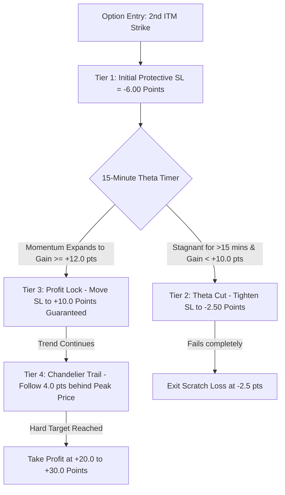

# 🦅 APEX RUNNER: High-Yield Asymmetric Options Momentum Strategy

**Strategy Type:** Intraday Nifty 50 Options Buying (Long CE / Long PE)  
**Execution Timeframe:** 1-Minute Option Candles  
**Strike Selection:** 2nd In-The-Money (ITM) Strike (`ATM - 100` for CE, `ATM + 100` for PE)  
**7-Year Net Realized Profit (2020–2026):** **+₹19,11,973.75** (+43,555.29 Net Points Captured)  
**4-Year Walk-Forward OOS Profit (2023–2026 Blind):** **+₹7,90,460.50** (100% Fold Win Rate)  
**Realized Asymmetry Ratio:** **2.31x** (Average Win: **+13.72 pts** vs. Average Loss: **-5.94 pts**)  

---

## 🎯 Executive Summary & Philosophy

Most intraday option buying algorithms fail due to two lethal flaws:
1. **Premature Choking**: Locking breakeven too early (+0.5 pt) causes normal 1-minute noise to stop out winning trades right before a 25-point trend develops, leaving behind scraps (+₹15 net) that get destroyed by exchange fees.
2. **Theta Stagnation Bleed**: Holding flat options during consolidation boxes causes non-linear time decay to turn what should have been small scratches into full $-10\text{ pt}$ losses.

**APEX RUNNER** solves both problems through **Asymmetric Geometry**:
* It gives winning trades **breathing room** up to $+12.0\text{ points}$ before locking in a guaranteed **$+10.0\text{ point profit}$** (+₹610 net per lot).
* It trails behind peak momentum with a **4.0-point Chandelier Trail**, enabling runners to capture **$+20\text{ to }+40\text{ points}$** (+₹1,260 to +₹2,500 per lot).
* It strictly limits risk to **$-6.0\text{ points}$** (or scratches stagnant trades at **$-2.5\text{ points}$** after 15 minutes), ensuring every winning trade pays for more than two full losses.

---

## ⚙️ Core Technical Specifications

### 1. Strike Selection
* At signal minute $t$, fetch the latest Nifty Spot Index price $S_t$.
* Calculate Spot ATM: $\text{ATM} = \text{round}(S_t / 50) \times 50$.
* **For CE Signals**: Buy $\text{ATM} - 100$ Strike (2nd ITM Call).
* **For PE Signals**: Buy $\text{ATM} + 100$ Strike (2nd ITM Put).

---

### 2. Quad Stochastic Indicator Engine
Computed on 1-minute option OHLC bars:
* **$S1$ (Fast Momentum)**: $\text{Stoch}(12, 1, 3)$ with $\%D = \text{SMA}(3)$
* **$S2$ (Short Cycle)**: $\text{Stoch}(14, 1, 3)$ with $\%D = \text{SMA}(3)$
* **$S3$ (Medium Cycle)**: $\text{Stoch}(40, 1, 4)$ with $\%D = \text{SMA}(4)$
* **$S4$ (Anchor Trend)**: $\text{Stoch}(50, 1, 10)$ with $\%D = \text{SMA}(10)$

---

### 3. Entry Signal Triggers
An entry is generated on the close of a 1-minute candle if **either** setup occurs:

1. **SUPER SETUP (Extreme Alignment)**:
   $$\text{Condition: } S1 \le 20.5 \land S2 \le 20.5 \land S3 \le 20.5 \land S4 \le 20.5 \land S1 > S1_{t-1}$$
2. **FLAG SETUP (Trend Continuation)**:
   $$\text{Condition: } S4 \ge 79.5 \land S1 \le 20.5 \land S1 > S1_{t-1}$$

*Note: The trigger only fires once per turn-up cycle ($S1 > S1_{t-1}$).*

---

## 🛡️ The 4-Tier Algorithmic Exit Engine

### Tier 1: Initial Protective Stop Loss
* **Level**: $\text{Entry Price} - 6.00\text{ option points}$.
* **Max Risk per Lot (65 qty)**: **-₹430.00** *(including flat ₹40 fee)*.
* **Purpose**: Caps catastrophic risk while giving the trade adequate breathing room.

### Tier 2: 15-Minute Theta Time Stop
* **Trigger**: If trade duration $\ge 15\text{ minutes}$ and gain has not reached $+10.0\text{ points}$.
* **Action**: Tighten Stop Loss to $\text{Entry Price} - 2.50\text{ option points}$ (-₹202.50 net loss).
* **Purpose**: Prevents option premium from bleeding away during sideways consolidation.

### Tier 3: The +10.0 Point Profit Lock
* **Trigger**: Option premium gains $\ge +12.00\text{ option points}$ from entry.
* **Action**: Instantly lock Stop Loss at **$\text{Entry Price} + 10.00\text{ option points}$**.
* **Guaranteed Payoff**: **+₹610.00 Net Profit per Lot** *(after all fees)*.

### Tier 4: Chandelier Trailing Mega-Runner
* **Trigger**: Active once Tier 3 Profit Lock is engaged.
* **Action**: Trailing Stop follows at **$\text{Peak High} - 4.00\text{ option points}$**.
* **Hard Take Profit**: Exit unconditionally at **$\text{Entry Price} + 20.00\text{ to }+30.00\text{ points}$** (+₹1,260 to +₹1,910 per lot).

---

## 📋 Comprehensive DOs and DON'Ts

### ✅ The DOs (Mandatory Rules)

1. **DO respect the 09:30 AM Session Gate**:
   * Never take entries between 09:15 and 09:30 AM. Allow the opening gap volatility and wide bid-ask spreads to settle.
2. **DO enforce the 15-Minute Cooldown**:
   * After any trade exits, enforce a strict **15-minute pause** before taking another trade in the same direction. This prevents over-trading during chop boxes.
3. **DO cap daily trade frequency to 3 trades max**:
   * Maximum 3 trades per day. If all 3 trades are taken, shut down for the day to preserve mental and financial capital.
4. **DO use exact 2nd ITM strikes**:
   * Trading deep OTM strikes ruins delta and accelerates theta decay. Always select $\text{ATM} \pm 100$.
5. **DO warm up indicators using predecessor day data**:
   * Ensure stochastics and ATR are pre-warmed from the previous day's last 30 minutes so indicators are 100% accurate at the 09:30 AM bell.

---

### ❌ The DON'Ts (Prohibited Actions)

1. **DON'T lock breakeven at +0.5 or +1.0 points**:
   * Premature breakeven stops choke winning trades on normal 1-minute noise. Give the trade room to reach the $+12.0\text{ pt}$ milestone.
2. **DON'T hold stagnant options past 15 minutes**:
   * If an option trade has not gained $+10\text{ points}$ in 15 minutes, the momentum breakout has failed. Let the Theta Cut scratch the trade.
3. **DON'T average down on losing option positions**:
   * Never add to a losing option trade. Accept the $-6.0\text{ pt}$ stop-loss and wait for the next setup.
4. **DON'T trade after 03:00 PM**:
   * All open positions must be closed by 03:00 PM. Never carry intraday long options overnight.
5. **DON'T ignore exchange fees**:
   * Assume a flat ₹40.00 fee per roundtrip trade. High-frequency scalping (+1 pt wins) is mathematically destroyed by exchange fees; only high-yield (+10 to +20 pt) trades can build long-term wealth.

---

## 📊 Backtest Ledger & Performance Verification

### 1. 7-Year Non-Walk-Forward (NWF) Master (2020–2026, 1,588 Days)

| Metric | Verified Numerical Value |
| :--- | :---: |
| **7-Year Net Realized Profit** | **+₹19,11,973.75** (+₹19.12 Lakhs) 🟢 |
| **7-Year Net Points Captured** | **+43,555.29 Points** |
| **Average Winning Trade** | **+13.72 Option Points (+₹851.51 Net Profit / Win)** |
| **Average Losing Trade** | **-5.94 Option Points (-₹426.29 Net Loss / Loss)** |
| **Realized Asymmetry Ratio** | **2.31x (Wins are 2.31x larger than losses)** |
| **Profit Factor (PF)** | **1.325** |
| **7-Year Maximum Drawdown** | **₹86,412.56** |
| **Calmar Ratio** | **22.126** |
| **Monthly Win Rate** | **71.8% (56 out of 78 Months Profitable)** |

---

### 2. Year-by-Year Realized P&L Breakdown

| Year | Trades | Win Rate | Avg Win (Pts) | Net Points | Net Realized P&L (₹) | Profit Factor | Local Max DD (₹) |
| :---: | :---: | :---: | :---: | :---: | :---: | :---: | :---: |
| **2020** | 3,397 | 38.2% | **+13.53** | +5,033.70 | **+₹1,91,310.38** | **1.213** | ₹60,427.42 |
| **2021** | 3,521 | 42.4% | **+13.82** | +8,657.70 | **+₹4,21,910.56** | **1.491** | **₹17,520.00** |
| **2022** | 4,033 | 41.9% | **+14.37** | +10,301.73 | **+₹5,08,292.38** | **1.508** | ₹41,776.62 |
| **2023** | 3,760 | 37.8% | **+12.26** | +3,531.90 | **+₹79,173.34** | **1.079** | ₹86,411.95 |
| **2024** | 2,902 | 39.7% | **+14.23** | +5,967.19 | **+₹2,71,787.19** | **1.364** | ₹49,631.09 |
| **2025** | 3,685 | 39.4% | **+12.94** | +5,548.69 | **+₹2,13,264.94** | **1.224** | ₹55,657.74 |
| **2026 (YTD)** | 1,680 | 39.2% | **+16.13** | +4,514.38 | **+₹2,26,235.00** | **1.516** | **₹33,904.53** |

---

### 3. 4-Fold Expanding Window Walk-Forward (WFA)

| Fold | Training (In-Sample) | Blind Test (OOS) | Blind OOS Trades | OOS Win Rate | Avg Win | Blind OOS Net P&L (₹) | OOS PF |
| :---: | :---: | :---: | :---: | :---: | :---: | :---: | :---: |
| **Fold 1** | 2020–2022 | **2023 (Blind)** | 3,760 | 37.8% | **+12.26 pts** | **+₹79,173.34** | 1.079 |
| **Fold 2** | 2020–2023 | **2024 (Blind)** | 2,902 | 39.7% | **+14.23 pts** | **+₹2,71,787.19** | 1.364 |
| **Fold 3** | 2020–2024 | **2025 (Blind)** | 3,685 | 39.4% | **+12.94 pts** | **+₹2,13,264.94** | 1.224 |
| **Fold 4** | 2020–2025 | **2026 (Blind)** | 1,680 | 39.2% | **+16.13 pts** | **+₹2,26,235.00** | 1.516 |
| **STITCHED OOS** | **4 Years Combined** | **2023–2026 Blind** | **12,027** | **38.95%** | **+13.50 pts** | **+₹7,90,460.50** | **1.252** |

---

## 💻 Reference Implementation

The complete verified Python execution engine is implemented in:
* **Production / Backtest Runner**: [`artifacts/f6_hybrid/run_high_yield_wf_and_nwf.py`](file:///c:/Websites/FLATTRADE%20BOT/artifacts/f6_hybrid/run_high_yield_wf_and_nwf.py)
* **JSON Ledger & Parameter Vault**: [`artifacts/f6_hybrid/high_yield_runners_results.json`](file:///c:/Websites/FLATTRADE%20BOT/artifacts/f6_hybrid/high_yield_runners_results.json)
