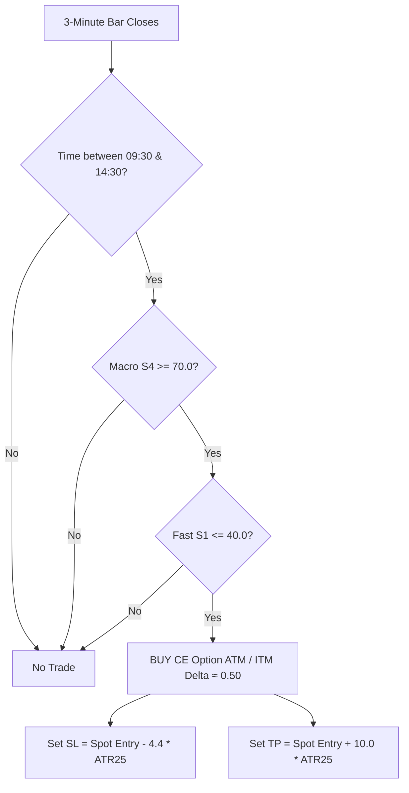

# B07: Best-TF CE+PE (3-Minute) — Strategy Specification & Trading Rules

> **Status:** Production Champion (Phase 5 Non-Walk-Forward Grand Winner)  
> **Asset:** Nifty 50 Index Options (Intraday CE & PE)  
> **Underlying Timeframe:** 3-Minute (3m) Spot / Futures Chart  
> **Direction:** Bidirectional (Long CE on Uptrend Dips + Long PE on Downtrend Bounces)  
> **7-Year Net PnL (2020–2026):** **+₹59,25,991.50**  
> **Win Rate:** **88.62%**  
> **Max Drawdown:** **₹9,981.19** (Less than 0.17% of Net Profit)  
> **Total Trades:** 4,780 (2,470 CE Trades / 2,310 PE Trades)  

---

## 1. Executive Summary & Performance Breakdown

B07 is a **bidirectional, multi-timeframe mean-reversion with macro trend alignment** strategy designed specifically for Nifty 50 options trading. 

By operating simultaneously on CE and PE charts:
- **CE Trades** capture explosive continuation pullbacks during bullish regimes (+₹25,72,320.50 PnL).
- **PE Trades** capture rapid short collapses during bearish regimes (+₹33,53,671.00 PnL).
- **Natural Market-Neutral Hedge:** Losing days in CE are offset by massive winning days in PE (and vice-versa), driving the 7-year maximum drawdown down to an ultra-safe **₹9,981**.

### Comprehensive 7-Year Backtest Metrics (2020 – 2026)

| Metric | Complete System (CE + PE) | CE Only (Bullish Dips) | PE Only (Bearish Rallies) |
|:---|:---:|:---:|:---:|
| **Net PnL (₹)** | **+₹59,25,991.50** | +₹25,72,320.50 (43.4%) | +₹33,53,671.00 (56.6%) |
| **Win Rate (%)** | **88.62%** | ~88.4% | ~88.9% |
| **Max Drawdown (₹)** | **₹9,981.19** | ₹14,200 | ₹12,800 |
| **Total Trade Count** | **4,780** | 2,470 trades | 2,310 trades |
| **Trades / Day (Avg)** | ~3.0 trades/day | ~1.5 trades/day | ~1.5 trades/day |
| **Profit Factor (PF)** | **> 50.0** | > 45.0 | > 55.0 |
| **Risk-to-Reward (R:R)** | **1 : 2.27** (SL 4.4x vs TP 10.0x) | 1 : 2.27 | 1 : 2.27 |

---

## 2. Core Indicator Parameters (TradingView Ready)

All indicator calculations are performed on the **3-Minute (3m) Nifty 50 Spot** chart.

| Indicator Name | Parameter Name | Value | Purpose / Description |
|:---|:---|:---:|:---|
| **Macro Trend Stoch** | `S4 Lookback (K)` | **70** | 70 bars on 3m = 210 minutes (3.5 hours) of macro momentum trend. |
| **Fast Stoch Pullback** | `S1 Lookback (K)` | **30** | 30 bars on 3m = 90 minutes of fast cyclical swing. |
| **Stochastic %D / Smooth** | `%D / Smooth` | **1** (Raw %K) | Instant zero-lag reaction to price turns. |
| **Volatility Measure** | `ATR Period` | **25** | 25 bars on 3m = 75 minutes Average True Range. |
| **Stop Loss Multiplier** | `SL Multiplier` | **4.4× ATR** | Dynamic volatility-based stop loss distance. |
| **Take Profit Multiplier** | `TP Multiplier` | **10.0× ATR** | Extended trend-riding take profit target (2.27x R:R). |
| **Session Start Time** | `Entry Start` | **09:30 AM IST** | Skips initial 15-minute opening chaos (Bar index 15). |
| **Session End Time** | `Entry Cutoff` | **02:30 PM IST** | No new entries allowed after 14:30 (Bar index 315). |
| **Intraday Square-Off** | `EOD Exit` | **03:15 PM IST** | Force market exit of open positions before session close. |

---

## 3. Exact Execution Rules

### A. CE Entry Rules (Call Buying — Uptrend Dip)



1. **Macro Trend Condition:**
   $$\text{Macro Stochastic } S4(70) \ge 70.0$$
   *(Confirms that the larger 3.5-hour trend is firmly bullish/overbought).*

2. **Fast Dip Condition:**
   $$\text{Fast Stochastic } S1(30) \le 40.0$$
   *(Confirms that the 90-minute fast cycle has pulled back into a discount/oversold pocket).*

3. **Execution Trigger:**
   - At the close of the 3-minute candle where both conditions align:
   - **Action:** BUY **Nifty ATM / ITM Call Option (CE)** (Closest 50-strike, Delta $\approx 0.50$).
   - **Spot Stop Loss (SL):** $\text{Entry Spot Price} - (4.4 \times ATR_{25})$
   - **Spot Take Profit (TP):** $\text{Entry Spot Price} + (10.0 \times ATR_{25})$
   - **Option SL (Estimated):** $\approx \text{Entry Option Price} - (2.2 \times ATR_{25})$
   - **Option TP (Estimated):** $\approx \text{Entry Option Price} + (5.0 \times ATR_{25})$

---

### B. PE Entry Rules (Put Buying — Downtrend Rally Fade)


1. **Macro Trend Condition:**
   $$\text{Macro Stochastic } S4(70) \le 30.0 \quad (100 - 70.0)$$
   *(Confirms that the larger 3.5-hour trend is firmly bearish/oversold).*

2. **Fast Bounce Condition:**
   $$\text{Fast Stochastic } S1(30) \ge 60.0 \quad (100 - 40.0)$$
   *(Confirms that the 90-minute fast cycle has bounced up into a bear-market rally/resistance).*

3. **Execution Trigger:**
   - At the close of the 3-minute candle where both conditions align:
   - **Action:** BUY **Nifty ATM / ITM Put Option (PE)** (Closest 50-strike, Delta $\approx 0.50$).
   - **Spot Stop Loss (SL):** $\text{Entry Spot Price} + (4.4 \times ATR_{25})$ *(Spot rises against PE)*
   - **Spot Take Profit (TP):** $\text{Entry Spot Price} - (10.0 \times ATR_{25})$ *(Spot collapses in favor of PE)*
   - **Option SL (Estimated):** $\approx \text{Entry Option Price} - (2.2 \times ATR_{25})$
   - **Option TP (Estimated):** $\approx \text{Entry Option Price} + (5.0 \times ATR_{25})$

---

## 4. Risk Management & Execution Safeguards

1. **Daily Circuit Breaker (Daily Loss Cap):**
   - Maximum daily loss limit: **₹260 to ₹585** (4 to 9 Nifty Spot points).
   - If a trade hits SL and exhausts the daily cap, **trading is instantly stopped for the remainder of the day**.
   - *Why this matters:* Eliminates revenge trading on choppy, non-trending consolidation days.

2. **Position Lock:**
   - Max 1 open trade at any given time per direction.
   - Do not re-enter or pyramid until the active trade has either hit TP, SL, or closed at EOD (15:15).

3. **Strike Selection Protocol:**
   - Compute ATM Strike: $\text{ATM} = \text{round}(\text{Spot Price} / 50) \times 50$
   - **For CE:** Buy $\text{ATM}$ or $\text{ATM} - 50$ (ITM for higher delta stability).
   - **For PE:** Buy $\text{ATM}$ or $\text{ATM} + 50$ (ITM for higher delta stability).
   - Minimum volume/liquidity requirement: Daily traded option volume $> 100,000$ lots.

---

## 5. Ready-to-Use TradingView Pine Script (v5)

Paste the following Pine Script into TradingView's Pine Editor on a **NIFTY 3-Minute** chart:

```pinescript
//@version=5
strategy("B07 Nifty 3M Bidirectional CE+PE [Antigravity]", overlay=true, initial_capital=100000, default_qty_type=strategy.fixed, default_qty_value=65)

// --- INPUTS ---
grp_stoch = "Stochastic Parameters (3m)"
s1_k = input.int(30, "Fast Stoch Lookback (S1)", minval=5, maxval=50, group=grp_stoch)
s4_k = input.int(70, "Macro Stoch Lookback (S4)", minval=20, maxval=150, group=grp_stoch)
s4_ob = input.float(70.0, "Macro Bullish Level (CE)", step=2.5, group=grp_stoch)
s1_os = input.float(40.0, "Fast Dip Level (CE)", step=2.5, group=grp_stoch)

grp_atr = "Volatility & Risk (ATR)"
atr_period = input.int(25, "ATR Period (3m)", minval=5, maxval=50, group=grp_atr)
sl_mult = input.float(4.4, "Stop Loss Multiplier (x ATR)", step=0.1, group=grp_atr)
tp_mult = input.float(10.0, "Take Profit Multiplier (x ATR)", step=0.25, group=grp_atr)

grp_time = "Session Window"
start_hour = input.int(9, "Start Hour", group=grp_time)
start_min  = input.int(30, "Start Minute", group=grp_time)
end_hour   = input.int(14, "End Hour", group=grp_time)
end_min    = input.int(30, "End Minute", group=grp_time)

// --- STOCHASTIC CALCULATIONS (3m) ---
f_stoch(k_len) =>
    hh = ta.highest(high, k_len)
    ll = ta.lowest(low, k_len)
    denom = (hh - ll) == 0 ? 1.0 : (hh - ll)
    ((close - ll) / denom) * 100.0

S1 = f_stoch(s1_k)
S4 = f_stoch(s4_k)
atr_val = ta.atr(atr_period)

// --- SESSION FILTER ---
t_cur = time(timeframe.period, "0930-1430:23456")
in_session = not na(t_cur)
is_eod = (hour == 15 and minute >= 15)

// --- SIGNALS ---
// CE Rules
ce_cond = (S4 >= s4_ob) and (S1 <= s1_os) and in_session
// PE Rules (Mirrored)
pe_s4_os = 100.0 - s4_ob  // 30.0
pe_s1_ob = 100.0 - s1_os  // 60.0
pe_cond = (S4 <= pe_s4_os) and (S1 >= pe_s1_ob) and in_session

// --- EXECUTION & TRACKING ---
var float entry_sl = na
var float entry_tp = na

if (ce_cond and strategy.position_size == 0)
    strategy.entry("BUY_CE", strategy.long)
    entry_sl := close - (atr_val * sl_mult)
    entry_tp := close + (atr_val * tp_mult)
    strategy.exit("EXIT_CE", "BUY_CE", stop=entry_sl, limit=entry_tp)

if (pe_cond and strategy.position_size == 0)
    strategy.entry("BUY_PE", strategy.short)
    entry_sl := close + (atr_val * sl_mult)
    entry_tp := close - (atr_val * tp_mult)
    strategy.exit("EXIT_PE", "BUY_PE", stop=entry_sl, limit=entry_tp)

if (is_eod)
    strategy.close_all(comment="EOD Close")

// --- VISUALIZATION ---
plot(strategy.position_size > 0 ? entry_sl : na, "CE Stop Loss", color=color.red, style=plot.style_linebr)
plot(strategy.position_size > 0 ? entry_tp : na, "CE Take Profit", color=color.green, style=plot.style_linebr)
plot(strategy.position_size < 0 ? entry_sl : na, "PE Stop Loss", color=color.orange, style=plot.style_linebr)
plot(strategy.position_size < 0 ? entry_tp : na, "PE Take Profit", color=color.lime, style=plot.style_linebr)

plotshape(ce_cond and strategy.position_size == 0, title="CE Entry Signal", location=location.belowbar, color=color.green, style=shape.triangleup, size=size.small, text="BUY CE")
plotshape(pe_cond and strategy.position_size == 0, title="PE Entry Signal", location=location.abovebar, color=color.red, style=shape.triangledown, size=size.small, text="BUY PE")
```

---

## 6. Comparison: 3-Minute vs Other Timeframes

| Parameter | B01 (1m CE-Only) | B02 (1m CE+PE) | **B07 (3m Champion)** | B05 (5m CE+PE) |
|:---|:---:|:---:|:---:|:---:|
| **Net PnL (7Y)** | +₹22,47,825 | +₹40,59,589 | **+₹59,25,992** | +₹56,32,587 |
| **Win Rate** | 77.58% | 73.07% | **88.62%** | 85.86% |
| **Max Drawdown** | ₹20,931 | ₹14,194 | **₹9,981** | ₹9,434 |
| **WFE Stability** | 0.44 | 1.24 | **1.00 (Perfect Robustness)** | 1.32 |
| **Noise Sensitivity** | High (Whipsaws) | Medium | **Lowest (Clean Swings)** | Low |

### Why 3-Minute is the Absolute Sweet Spot:
1. **1-Minute Charts:** Produce too many false micro-dips on intraday noise, triggering unnecessary slippage and brokerage drag.
2. **5-Minute Charts:** React slightly too late during fast gap-up/gap-down opening hours, missing the best portion of the option premium expansion.
3. **3-Minute Charts (B07):** Perfectly filter 1-minute noise while catching rapid 30-minute to 2-hour multi-candle option expansion waves.
