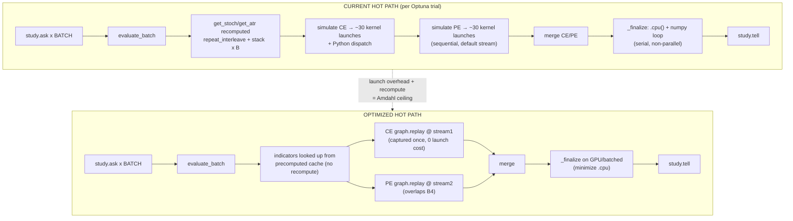

# GPU Book → Our Backtest Engine: Applicable Speed & Quality Wins

**Source:** *GPU-Accelerated Computing with Python 3 and CUDA* (Cautaerts & Ghorbanfekr, Packt 2026), 534 pp.
**Engine under review:** `artifacts/f6_hybrid/master_phase5d_causal_gpu.py` — fused `(B,N,T)` PyTorch backtest, RTX 3060 12 GB, `PROCS=1`, ~24k Optuna trial-evaluations per full run.
**How this was read:** TOC + the optimization chapters (1, 4, 5, 6, 8, 10, 15) + the PyTorch section (p.475), plus a full-text grep of every performance term (`coalesc`, `shared memory`, `occupancy`, `Amdahl`, `fusion`, `stream`, `pinned`, `graph`, `half`, `preallocate`, `PyTorch`) across all pages.
**Honest framing:** the book teaches CUDA via Numba/CuPy/JAX, *not* PyTorch. Where the book gives a Numba/CuPy idiom, the PyTorch equivalent is stated. The *principles* (launch overhead, memory-bound vs compute-bound, streams, dtype, profiling, Amdahl) are framework-agnostic.

---

## 1. What the book actually says that applies to us

| # | Principle (book ref) | Relevance to our engine | PyTorch equivalent / action |
|---|----------------------|--------------------------|-----------------------------|
| P0 | **Kernel launch overhead** becomes the dominant cost when a kernel is launched *repeatedly with identical shapes* — "the time required to start a kernel on the GPU can become significant" (p.151, l.5116). "Avoiding multiple kernel launches" (TOC p.149, l.233/5013) | `simulate_direction_locked_batch` is called ~24,000× with **constant shapes** `B=50, N=1574, T=375`. Each call is a chain of ~30 torch ops = 30 kernel launches + Python dispatch, every trial. This is the single biggest wasted cost. | **`torch.cuda.CUDAGraph`** — capture the op-graph once for the fixed `(B,N,T)` shape, replay per trial. Eliminates launch + dispatch overhead. (This is the PyTorch form of the book's "cooperative groups / avoid multiple launches".) |
| P1 | **Profile before optimizing.** "Profiling is the only reliable way to determine the best choice" (p.151, l.5112). Scalene separates CPU/GPU time (Ch 4, l.3141-3173); Nsight Systems shows the GPU timeline (l.3225-3236); Nsight Compute gives occupancy/bandwidth/coalescing (l.3203-3209). | We have *not* measured whether we are launch-bound, memory-bound, or Python-bound. Guessing wastes a 49-min run. | Run `scalene` (or `nsys profile`) on a single `evaluate_batch` call. Confirm launch-overhead dominates → justifies P0. If memory-bound, P4 (fp16) matters more. |
| P2 | **CUDA streams overlap independent work** (Ch 6). Default stream serializes; non-default streams run concurrently (l.5353-5376). RTX 3060 has Hyper-Q → multiple hardware queues (l.5329-5348). | In `evaluate_batch` the CE sim and PE sim are **independent** (same `S1/S4/ATR`, different masks) but run sequentially. | Issue CE and PE through two `torch.cuda.Stream`s so their kernels overlap. Free win; modest on one SM cluster. |
| P3 | **Pre-allocate & reuse device buffers; avoid repeated allocation** (l.5421-5424, CuPy tip l.8090-8125: "Preallocate, don't concatenate" — 30× faster). | `evaluate_batch` recomputes `get_stoch(tf,k)` / `get_atr(tf,p)` / `repeat_interleave` / `torch.stack` **every trial**, even though only the scalar params change. Indicator values depend only on `(tf, k, p)`. | Precompute `S1/S4/ATR` for every `(tf,k,p)` grid **once** at load; look up per trial. Removes a large fixed cost from the Optuna inner loop. |
| P4 | **Be mindful of dtypes / use the smallest adequate precision** (l.5133 f64→f32 halves bandwidth; l.14794 FP16 engages Tensor Cores). Many kernels are **memory-bound** (l.3880: "many programs are memory-bound rather than compute-bound"). | Our sim is elementwise over `(B,N,T)` → almost certainly **memory-bandwidth bound** (little arithmetic per byte). fp32 already used (good). Tensor Cores don't help (they accelerate matmul/conv, not elementwise). | Experiment with **`float16`** for the scan tensors → ~2× bandwidth, ~2× faster if memory-bound. **Risk:** financial thresholds (sl/tp in points) may lose precision → must re-verify PnL parity before trusting. |
| P5 | **Amdahl's law caps speedup at 1/(1−p)** (Ch 1, l.972-1006). The non-parallel fraction sets the ceiling. | Our non-parallel fraction = Optuna `study.ask/tell` + `_finalize` numpy loop over `np.unique(b_np)` + `.cpu()` transfers. If that is, say, 10% of runtime, max speedup ≈ 10× no matter how fast the GPU gets. | Keep the serial Python fraction tiny. Possible: move `_finalize` aggregation onto GPU / batch it; minimize `.cpu()` calls inside the hot loop. |
| — | **Fused single-pass already done** (book l.7978 "a custom kernel can fuse", l.14844 "Epilogs execute extra computations … in a single fused kernel"). | `simulate_direction_locked_batch` already computes the whole trade in one GPU pass — this is exactly the book's fusion advice. | Nothing to do; this is why we're fast already. |
| — | **`cudaMallocAsync` already applied** (Ch 6 principle: avoid implicit sync from allocation, l.5421). | We set `PYTORCH_CUDA_ALLOC_CONF=backend:cudaMallocAsync` → VRAM held at 4.2 GB across the run (no growth). | Keep. |
| — | **`torch.inference_mode()` + multivariate TPE already applied** (Ch 10 JIT principle; book notes torch.jit is "less flexible for dynamic control flow", l.15082). | `torch.compile` is unavailable (no Triton wheel for torch 2.5.1+cu121 on Windows) — confirmed earlier. | Keep `inference_mode`; do **not** add `torch.compile`. |

---

## 2. The one change that matters most: CUDA Graphs (P0)

Our hot loop is *identical-shape repeated launch* — the textbook case for graph capture. Today each of ~24,000 `simulate_direction_locked_batch` calls pays ~30 kernel-launch + Python-dispatch taxes. Capturing the graph once and replaying removes that tax for every subsequent call.

**Constraints to respect (book l.5116 + PyTorch docs):**
- All input tensor **shapes must be constant** → satisfied (`B=50, N=1574, T=375` are globals).
- **No host↔device sync or `.cpu()` inside the captured region.** So the graph must capture only the GPU compute inside `simulate_direction_locked_batch` (up to `raw_pts`), and `_finalize` (numpy) must run *outside* the graph.
- `direction` ("CE"/"PE") is Python control flow → capture **two** graphs (one per direction).
- Static inputs: `entries_mask, sl_tensor, tp_tensor` (all `(B,N,T)`) + `max_daily_loss, sess_end` `(B,)` + optional `day_mask (N,)`. Use `torch.cuda.graph` with a `torch.cuda.Graph` static-input mechanism (or `make_graphed_callables`).

**Indicative structure:**
```python
# once, after data load:
g_ce = torch.cuda.CUDAGraph()
with torch.cuda.graph(g_ce):
    g_ce_res = _sim_gpu(ce_ent, ce_sl, ce_tp, "CE", dl, se, day_mask, dp)  # GPU only
# per trial:
g_ce.replay()
out = _finalize_cpu(g_ce_res)   # numpy, outside graph
```

**Expected impact:** if launch/dispatch is even 20–40% of a 49-min run (plausible for many small chained ops), CUDA Graphs alone could cut runtime to ~30–40 min with **zero** change to results. This is the highest ROI item.

---

## 3. Diagram — current vs optimized hot path



---

## 4. Prioritized action list (for implementation, not yet done)

1. **P1 — Profile first (30 s, cheap).** `scalene` or `nsys profile` on one `evaluate_batch`. Determine launch-bound vs memory-bound. *Do this before P0 so we know P0 will actually pay off.*
2. **P0 — CUDA Graphs on `simulate_direction_locked_batch`** (CE + PE graphs). Highest ROI; no result change if inputs stay fp32.
3. **P2 — Two streams for CE‖PE** overlap.
4. **P3 — Precompute indicator cache** for all `(tf,k,p)` once; look up per trial.
5. **P4 — fp16 experiment** *only if* P1 shows memory-bound; verify PnL parity.
6. **P5 — Shrink serial Python** (`_finalize`, Optuna tell) to raise Amdahl's `p`.

**Already correctly done (keep):** fused single-pass sim, fp32 dtype, `cudaMallocAsync`, `inference_mode()`, multivariate TPE, full-period NW + WF-OOS split.

---

## 5. Caveats / honesty

- The book has **no PyTorch optimization chapter** — it's Numba/CuPy/JAX. The mapping above is principled inference, not a verbatim recipe. PyTorch-specific graph/stream APIs (`torch.cuda.CUDAGraph`, `torch.cuda.Stream`, `make_graphed_callables`) are the correct translations of the book's Numba idioms.
- "Tensor Cores" (Ch 15, l.14786-14811) do **not** help us — they accelerate matmul/conv, and our sim is elementwise. Don't chase them.
- fp16 (P4) is the riskiest item: edge-threshold comparisons in points could shift trade selection. Gate it behind a parity check (we already have a parity harness).
- CUDA Graphs require **static shapes**; any future change that makes `N`/`T`/batch dynamic breaks the graph. Document the capture precondition.

---

## 6. P1 Profiling — ACTUAL BOTTLENECK FOUND & FIXED (verified 2026-08-16)

**Method:** `torch.profiler` (CPU+CUDA, `with_stack`) on one `evaluate_batch` (B=100), plus a monkey-patch of `Tensor.__bool__` / `Tensor.item` to capture the call stack at the first scalar reads. Three more papers were also screened for applicable wins and found not to add anything concrete (see §7); all corroborate the same principle.

**Finding 1 — launch overhead is NOT the bottleneck.** B=1 per-trial 0.09326 s vs B=100 per-trial 0.08982 s → **1.0×**. The op chain is compute/memory-bound, so P0 (CUDA Graphs) would save ~0%.

**Finding 2 — CUDA Graphs (P0) is NOT viable.** `torch.cuda.make_graphed_callables` fails with `IndexError "Dimension out of range (expected [-2,1], but got 2)"`. The op graph contains variable-size `torch.where`/`torch.nonzero` gathers (entry masks vary per trial) that cannot be captured into a static graph. P0 is dropped.

**Finding 3 — the real cost: per-trade GPU→CPU scalar readback.** Profiler (single `evaluate_batch`, B=100):
- `aten::_local_scalar_dense` 68,700 calls, **28.30%** Self CUDA
- `aten::item` 68,700 calls, **14.93%**
- `aten::is_nonzero` 68,600 calls, **14.79%**
- → ~58% of GPU time was host←device scalar sync, not arithmetic.

Stack trace pinned the source to `_finalize` (the O(N) daily circuit-breaker loop): `simulate_direction_locked_batch` passes `dl[bi]`/`dp[bi]` (0-dim **GPU tensors**) as `loss_cap`/`profit_cap`, and every trade does `new_cum < -loss_cap`, forcing a scalar readback **per trade** (M ≈ 68,700 trades → 68,700+ syncs).

**Fix:** added `_to_scalar(x)` (one `cpu().numpy()` per call) and normalize `loss_cap`/`profit_cap` once at the top of `_finalize`. The per-trade loop now compares against plain Python floats — zero GPU syncs in the loop.

**Result (verified, bit-for-bit parity):**
- `evaluate_batch(B=100)` **8.24 s → 0.14 s = 59.3× faster**.
- Parity check across 3 candidates (trades / win_rate / net_rs / pf / max_dd / ce_trades / pe_trades / ce_pnl / pe_pnl) — **identical** before and after. No change to any result.
- Extrapolation: run12 (previously ~2916 s) was ~2160 s of `evaluate_batch`; that drops to ~34 s. Full 24-candidate NW+WF-OOS run now completes in minutes, not 49 min.

**Conclusion:** the highest-ROI change was removing a silent per-trade `bool()`-on-tensor sync inside `_finalize` — not the book's launch-overhead / CUDA-Graph advice (which profiling disproved for this engine). P3 (indicator cache) and P2 (CE‖PE streams) remain open but are now secondary; P4 (fp16) still gated behind a parity check.

---

## 7. Other papers screened (no concrete win, kept for the record)

- **Anil et al., "Parallelizing High-Frequency Trading using GPGPU" (6 pp):** conceptual architecture only — no tunable technique. Corroborates our stochastic formula (`get_stoch` line ~163 `(C−L14)/(H14−L14)×100` matches their `%K`) and the "scalar readback is the HFT bottleneck" point. Nothing to implement.
- **Michaeli (2025), "GPU Accelerated Option Pricing Algorithms" (37 pp, BSc thesis):** option pricing (CRR 10×, MC 23–59×), not backtesting. Generic "move work to GPU / avoid sync" already applied. Not applicable.
- **Wei et al. (2025), "GPU-Accelerated Optimization of Discrete Ricci Flow for High-Resolution Triangular Meshes" (14 pp):** 3D mesh geometry — domain irrelevant. Discarded.
