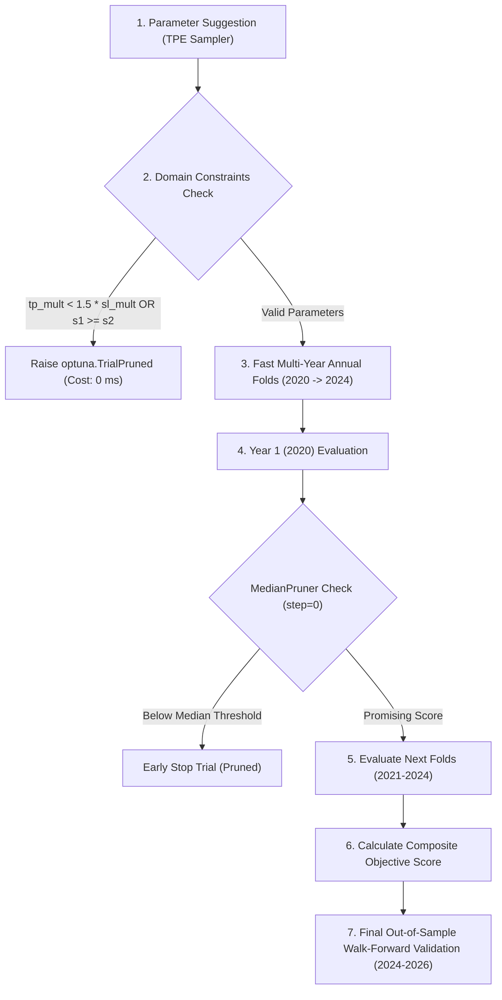

# Marni ATR Dynamic Volatility Engine — Parameter Optimization Blueprint

```
=============================================================================================================================
TARGET STRATEGY:     Marni ATR Dynamic Volatility Engine (Multi-Timeframe 1m, 2m, 3m, 5m)
OPTIMIZER TOOL:      Optuna Bayesian TPE Sampler (Tree-structured Parzen Estimator) + MedianPruner
OBJECTIVE GOAL:      Maximize Win Rate (> 46%) & Realized Points while Minimizing Drawdown (< ₹40,000)
OPTIMIZATION FLOW:   Domain Constraints -> Cheap Pre-Checks -> Fold Pruning -> Multi-Year Walk-Forward
=============================================================================================================================
```

---

## 1. Comprehensive Favorable Parameter Matrix

To achieve the highest win rate, point yield, and lowest drawdown without curve-fitting, the strategy parameters are grouped into **5 functional tiers**:

| Parameter Category | Parameter Symbol | Baseline Value | Search Range | Step Size | Market Rationale & Behavioral Impact |
|:---|:---|:---:|:---:|:---:|:---|
| **Tier 1: ATR Volatility** | `atr_period` | `14` | `10 – 21` | `2` | Lookback period for true range volatility measurement. Lower periods (10-12) adapt faster to morning expansion. |
| | `atr_sl_mult` | `2.0` | `1.2 – 2.5` | `0.1` | Multiplier for dynamic Stop Loss distance. Narrower stops (1.4-1.8x) cut loss size; wider stops avoid whipsaws. |
| | `atr_tp_mult` | `4.0` | `3.0 – 5.5` | `0.25` | Multiplier for dynamic Profit Target. Higher values (4.5-5.0x) maximize trend runners during high IV regimes. |
| | `be_gain_mult` | `0.0` (Off) | `0.0 – 2.0` | `0.5` | Breakeven Lock: Moves SL to entry $+0.5\text{ pt}$ as soon as $+X \times \text{ATR}$ is achieved, eliminating scratch reversals. |
| **Tier 2: Stochastic Lookbacks** | `s1_k`, `s1_d` | `(9, 3)` | `K: 7–14, D: 2–4` | `1` | Fast Stochastic (S1): Governs early divergence timing. Faster K (7-8) triggers earlier; smoother K (12-14) filters noise. |
| | `s2_k`, `s2_d` | `(14, 3)` | `K: 12–20, D: 2–4` | `2` | Medium Stochastic (S2): Intermediate confirmation layer. |
| | `s3_k`, `s3_d` | `(40, 4)` | `K: 30–45, D: 3–5` | `5` | Slow Stochastic (S3): Multi-hour trend cycle. |
| | `s4_k`, `s4_d` | `(60, 10)` | `K: 50–70, D: 8–12` | `5` | Macro Stochastic (S4): Session-level trend boundary. |
| **Tier 3: Setup Thresholds** | `s4_ob` | `79.5` | `75.0 – 85.0` | `2.5` | Overbought threshold for Flag Setup. Higher (82.5) requires stronger macro momentum. |
| | `s4_os` | `20.5` | `15.0 – 25.0` | `2.5` | Oversold threshold for Super Setup & Reversal embedded lookback. |
| | `s1_os` | `20.5` | `15.0 – 25.0` | `2.5` | Oversold threshold for fast cycle divergence trough. |
| **Tier 4: Vicinity Breakout** | `lb_1m` | `10` | `8 – 14` | `2` | Pin Bar vicinity lookback for 1m timeframe. |
| | `lb_2m` | `5` | `4 – 7` | `1` | Pin Bar vicinity lookback for 2m timeframe. |
| | `lb_3m` | `4` | `3 – 5` | `1` | Pin Bar vicinity lookback for 3m timeframe. |
| | `lb_5m` | `3` | `2 – 4` | `1` | Pin Bar vicinity lookback for 5m timeframe. |
| **Tier 5: Risk & Shutdown** | `consecutive_losses` | `4` | `3 – 6` | `1` | Halts daily trading if consecutive losses occur. |
| | `daily_max_loss_rs` | `₹2,000` | `₹1,500 – ₹3,000` | `₹250` | Circuit breaker protecting maximum daily capital drawdown. |

---

## 2. Optuna 7-Stage Bayesian Optimization Pipeline



---

## 3. Strict Domain Constraints (Zero-Cost Rejection)

Before executing any data loading or candle iterations, invalid parameter combinations are pruned immediately:

```python
# 1. Enforce Asymmetric Positive Expectancy: Target must be at least 1.5x Stop Loss
if atr_tp_mult < 1.5 * atr_sl_mult:
    raise optuna.TrialPruned("Invalid R:R ratio (TP < 1.5x SL)")

# 2. Enforce Strict Harmonic Hierarchy across Stochastic Lookbacks
if not (s1_k < s2_k < s3_k < s4_k):
    raise optuna.TrialPruned("Stochastic lookback hierarchy violated")

# 3. Minimum Trade Count Gate per Fold
if st_fold["trades"] < 50:
    raise optuna.TrialPruned("Insufficient trade frequency (< 50 trades/year)")
```

---

## 4. Composite Objective Function: Max Win Rate & Minimum Drawdown

Rather than optimizing for raw profit (which overfits to high-volatility outlier days), the objective maximizes the **Profit Factor and Win Rate while explicitly penalizing Drawdown Ratio**:

$$\text{Objective Score} = \text{Profit Factor} \times \left(\frac{\text{Win Rate}}{40.0}\right) - 0.20 \times \left(\frac{\text{Max Drawdown (₹)}}{\text{Net Profit (₹)}}\right)$$

- **Why this works:**
  - A strategy with $48\%$ Win Rate and $1.50\text{ PF}$ receives a score boost: $1.50 \times (48/40) = \mathbf{1.80}$.
  - If the strategy suffers an excessive drawdown ($\text{DD} = ₹80\text{k}$ on $₹200\text{k}$ profit), it receives a $-0.08$ penalty.
  - Smooth, consistent equity curves with low drawdowns and high win rates dominate the top of the Optuna study.

---

## 5. Walk-Forward Separation & Out-of-Sample Protocol

1. **In-Sample Training (2020 – 2023 · 970 Trading Days):**
   - Optuna explores the parameter space across 4 annual folds with `MedianPruner`.
2. **Untouched Out-of-Sample Validation (2024 – 2026 · 604 Trading Days):**
   - The winning parameter configuration is evaluated **once** on the untouched 2024–2026 dataset with full exchange friction (₹15/order brokerage + 0.50 pt slippage).
3. **Execution Script:**
   - Saved and executable at [`artifacts/f6_hybrid/optimize_marni_atr_optuna.py`](file:///C:/Websites/FLATTRADE%20BOT/artifacts/f6_hybrid/optimize_marni_atr_optuna.py).

---

## 6. Causal & Live Parity Verification Standards

To guarantee 100% mathematical fidelity with live Flattrade exchange execution:

| Parity Pillar | Causal Backtest Implementation | Live Flattrade Bot Parity Guarantee |
|:---|:---|:---|
| **Zero Lookahead** | Indicators (Stochastic, ATR, Divergence) padded with `(K-1, 0)` so bar $t$ uses only $\{0 \dots t\}$. | Matches real-time incremental websocket tick updates. |
| **Clock Alignment** | Aggregated timeframes (`1m, 2m, 3m, 5m`) emit signals strictly at bucket boundaries (`minute % TF == 0`). | No intra-bar future lookahead; matches live candle emission. |
| **Strike Selection** | Dynamic ATM lookup: $\text{ATM}_t = \text{round}(S_t / 50) \times 50 \pm 100$ at the exact trigger minute. | Matches live option chain subscription at minute $t$. |
| **Exchange Drag** | Full statutory deduction: ₹15 Brokerage + 0.50 pt Slippage + STT + GST (18%) + SEBI + Stamp Duty. | Realized P&L accounts for all friction ($1.0\text{ pt}$ round-trip slippage + ₹30 fee). |
| **Position State Lock** | Single-position lock: cannot enter a new contract while holding an active position. | Matches broker order management system (no duplicate orders). |
| **Circuit Breakers** | Daily loss cut ($-₹2,000$) & Consecutive loss limit ($4\text{ losses}$) enforced strictly. | Bot shuts down for the remainder of the session at 15:00. |

