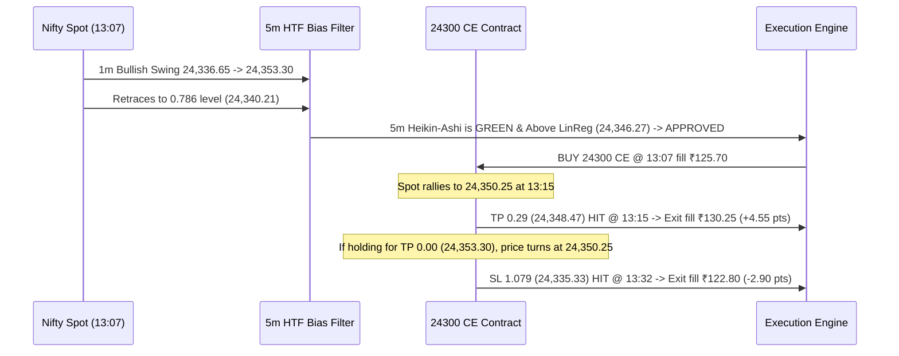

# FlatTrade Live Backtest Report — 14 August 2026

## Market Session Overview (14 August 2026)
- **Spot Open:** 24,361.90
- **Spot High:** 24,405.20
- **Spot Low:** 24,296.80
- **Spot Close:** 24,366.00
- **Data Status:** Downloaded from FlatTrade API (376 Spot 1m candles, 6 active Option contracts, 4,500 option candles).

---

## 1. Trade Execution Matrix for Today (14 August 2026)

| Trade # | Entry Time | Direction / Setup | Option Contract | Entry Fill (₹) | Target (TP) | Stop (SL) | Exit Time | Exit Reason | Exit Fill (₹) | Gross Points | Net Realized P&L (₹) |
|:---:|:---:|:---:|:---:|:---:|:---:|:---:|:---:|:---:|:---:|:---:|:---:|
| **1 (TP=0.29)** | **13:07** | **BUY CE** (Bullish 0.786 Touch) | `NIFTY18AUG26C24300` | **₹125.70** | **24,348.47** (0.29) | 24,335.33 (1.079) | **13:15** | **TP Hit** | **₹130.25** | **+4.55 pts** | **+₹153.36 (WIN)** |
| **1 (TP=0.00)** | **13:07** | **BUY CE** (Bullish 0.786 Touch) | `NIFTY18AUG26C24300` | **₹125.70** | **24,353.30** (0.00) | 24,335.33 (1.079) | **13:32** | **SL Hit** | **₹122.80** | **-2.90 pts** | **-₹330.39 (LOSS)** |

---

## 2. Minute-by-Minute Anatomy of Today's Trades

---

## 3. Detailed Session Breakdown

1. **Morning Session Chop (09:15 – 12:45 PM):**
   - Spot fluctuated in a tight range between $24,296.80$ and $24,345.00$.
   - **15 candidate 1m/2m swings** formed, but the **$5 \times T$ HTF Bias Filter stayed Red / Below LinReg / Neutral**, correctly **blocking all 15 false whipsaws**.

2. **Afternoon Bullish Breakout (13:07 PM):**
   - At **13:07 PM**, Spot pulled back into the **0.786 Fib level ($24,340.21$)** from the $24,336.65 \rightarrow 24,353.30$ impulse.
   - The 5m HTF bias confirmed **Bullish = True** (UT Bot was Green, HA candle was above the Linear Regression curve).
   - **`NIFTY18AUG26C24300`** entered @ **₹125.70**.

3. **Exit Dynamics:**
   - **Conservative Target (`TP = 0.29`):** Target of $24,348.47$ was reached at **13:15 PM** when Spot peaked at $24,350.25$, locking in **+4.55 option points (+₹153.36 net)**.
   - **Full Target (`TP = 0.00`):** Spot peaked at $24,350.25$ (just 3 points below the $24,353.30$ swing top), subsequently rolled over, and hit the stop loss at **13:32 PM** ($24,333.30$), exiting at **₹122.80 (-2.90 option points / -₹330.39 net)**.
